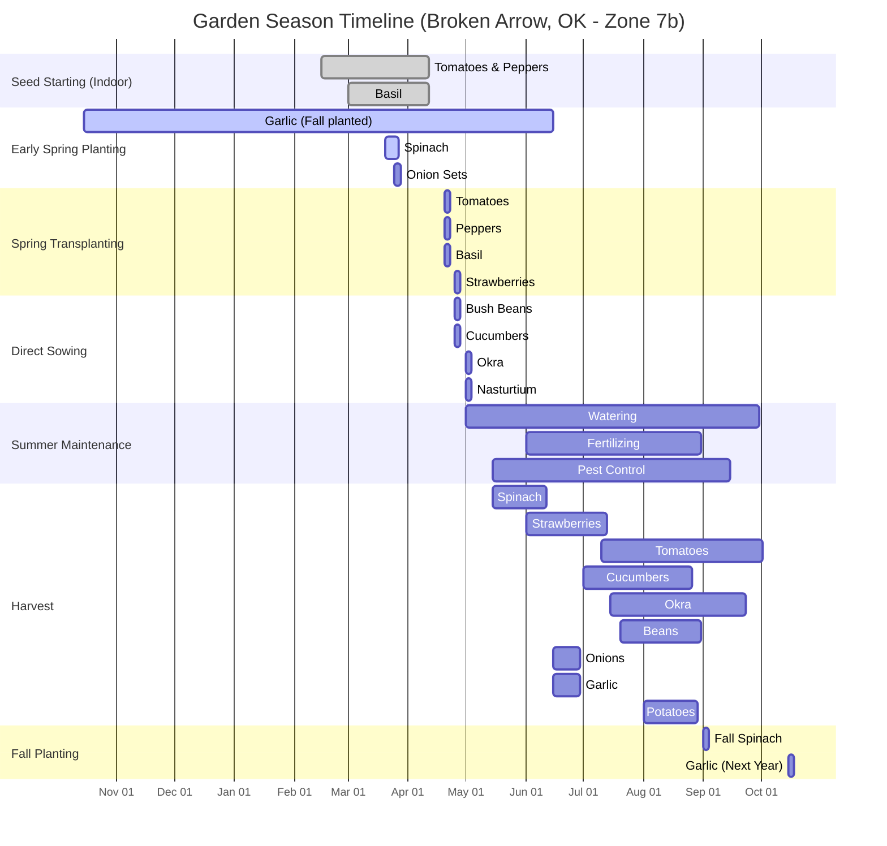

# 2025 Technical Garden Plan - Main Beds
**Location:** Broken Arrow, OK (Zone 7b)  
**Scale:** 1 grid square = 1 square foot  
**Origin:** Southwest corner of property (0,0)  
**Orientation:** North is up  

## Garden Layout Overview

```mermaid
graph TD
    %% Coordinate System Reference
    subgraph "Coordinate System"
        ORIGIN[Origin: 0,0<br/>SW Corner]
        NORTH[North ↑]
        SCALE[Scale: 1 sq = 1 sq ft]
    end

    %% West Beds (Left Side)
    subgraph "West Beds - Full Sun"
        A[Bed 1: Spinach<br/>Location: 10,10<br/>Size: 4' x 8' x 12"<br/>Variety: Bloomsdale Long Standing<br/>Qty: 3 rows x 12 plants<br/>Spacing: 6" apart<br/>Method: Direct Sow<br/>Soil: 50% topsoil, 30% compost, 20% vermiculite]
        
        B[Bed 2: Bush Beans & Rosemary<br/>Location: 10,20<br/>Size: 4' x 8' x 12"<br/>Variety: Blue Lake Bush, Arp Rosemary<br/>Qty: 10 bean plants, 2 rosemary<br/>Spacing: Beans 6" apart, Rosemary 18" apart<br/>Method: Direct Sow + Transplant<br/>Soil: 60% topsoil, 25% compost, 15% sand]
        
        C[Bed 3: Strawberry, Jalapeño, Borage<br/>Location: 10,30<br/>Size: 4' x 8' x 12"<br/>Variety: Albion Strawberry, Early Jalapeño, Borage<br/>Qty: 6 strawberry crowns, 1 pepper, 2 borage<br/>Spacing: Strawberries 12" apart, Pepper 18" center<br/>Method: Crowns + Transplant<br/>Soil: 55% topsoil, 30% compost, 15% peat moss]
    end

    %% East Beds (Right Side)
    subgraph "East Beds - Full Sun"
        D[Bed 4: Tomato & Basil<br/>Location: 20,10<br/>Size: 4' x 8' x 12"<br/>Variety: Cherokee Purple Tomato, Genovese Basil<br/>Qty: 2 tomato plants, 4 basil plants<br/>Spacing: Tomatoes 24" apart, Basil 12" apart<br/>Method: Transplant<br/>Soil: 50% topsoil, 30% compost, 20% vermiculite<br/>Amendments: Bone meal, azomite]
        
        E[Bed 5: Cucumber, Nasturtium, Oregano<br/>Location: 20,20<br/>Size: 4' x 8' x 12"<br/>Variety: Marketmore 76, Alaska Mix, Greek Oregano<br/>Qty: 2 cucumber plants, 3 nasturtium, 1 oregano<br/>Spacing: Cucumbers 18" apart, Nasturtium 12" apart<br/>Method: Transplant + Direct Sow<br/>Soil: 60% topsoil, 25% compost, 15% sand<br/>Trellis: 6' bamboo poles]
        
        F[Bed 6: Okra & Basil<br/>Location: 20,30<br/>Size: 4' x 8' x 12"<br/>Variety: Clemson Spineless Okra, Sweet Basil<br/>Qty: 4 okra plants, 4 basil plants<br/>Spacing: Okra 18" apart, Basil 12" apart<br/>Method: Transplant<br/>Soil: 55% topsoil, 30% compost, 15% sand<br/>Amendments: Chicken manure compost]
    end

    %% Vertical Planters
    subgraph "Vertical Planters - Space Optimization"
        G[VP 1: Onions & Garlic<br/>Location: 15,40<br/>Size: 2' x 8' x 18"<br/>Variety: Yellow Onion Sets, Hardneck Garlic<br/>Qty: 2 rows x 16 onions, 2 rows x 16 garlic<br/>Spacing: 4" apart<br/>Method: Sets + Cloves<br/>Soil: 40% topsoil, 40% compost, 20% sand]
        
        H[VP 2: Potatoes<br/>Location: 25,40<br/>Size: 2' x 8' x 18"<br/>Variety: Yukon Gold, Red Pontiac<br/>Qty: 2 rows x 8 seed potatoes each<br/>Spacing: 12" apart<br/>Method: Seed Potatoes<br/>Soil: 50% topsoil, 30% compost, 20% sand<br/>Hilling: 3 stages]
    end

    %% Paths and Connections
    subgraph "Paths & Infrastructure"
        PATH1[Main Path<br/>Location: 15,15 to 15,35<br/>Width: 3'<br/>Material: Mulch]
        PATH2[Cross Path<br/>Location: 10,18 to 30,18<br/>Width: 2'<br/>Material: Mulch]
        WATER[Water Source<br/>Location: 5,25<br/>Type: Spigot + Hose]
    end

    %% House/Structure
    subgraph "Fixed Structures"
        HOUSE[House<br/>Location: 0,0 to 8,40<br/>Shadow: Casts shade on west beds in morning]
    end

    %% Define Connections
    A --- PATH1 --- D
    B --- PATH2 --- E
    C --- PATH1 --- F
    G --- PATH2 --- H
    
    %% Styling
    linkStyle default stroke-width:2px,stroke:#666
    classDef bedStyle fill:#e8f5e8,stroke:#2d5a2d,stroke-width:2px
    classDef pathStyle fill:#f4f4d4,stroke:#d4d42a,stroke-width:2px
    classDef structureStyle fill:#e6e6e6,stroke:#666,stroke-width:2px
    
    class A,B,C,D,E,F,G,H bedStyle
    class PATH1,PATH2 pathStyle
    class HOUSE structureStyle
```

## Planting Schedule Gantt Chart



## Soil Amendment Schedule

| Bed | Pre-Planting | Mid-Season | Post-Harvest |
|-----|--------------|------------|--------------|
| 1 (Spinach) | Blood meal, compost | Fish emulsion | Chicken manure compost |
| 2 (Beans) | Compost, inoculant | None needed | Chicken manure compost |
| 3 (Strawberry) | Bone meal, compost | Fish emulsion | Straw mulch |
| 4 (Tomato) | Bone meal, azomite, compost | Fish emulsion, Epsom salt | Chicken manure compost |
| 5 (Cucumber) | Compost, sand | Fish emulsion | Chicken manure compost |
| 6 (Okra) | Chicken manure compost | Fish emulsion | Chicken manure compost |
| VP1 (Onions) | Bone meal, compost | None needed | Chicken manure compost |
| VP2 (Potatoes) | Compost, sand | Fish emulsion | Chicken manure compost |

## Companion Planting Benefits

- **Bed 4:** Basil repels tomato hornworms, improves tomato flavor
- **Bed 5:** Nasturtium attracts aphids away from cucumbers, oregano deters pests
- **Bed 6:** Basil and okra are mutually beneficial, basil deters whiteflies
- **Bed 3:** Borage attracts pollinators, improves strawberry yield
- **Bed 2:** Rosemary deters bean beetles

## Succession Planting Opportunities

- **Bed 1:** Spinach → Fall spinach (September)
- **Bed 2:** Beans → Fall peas (August)
- **Bed 5:** Cucumbers → Fall radishes (August)
- **Bed 6:** Okra → Fall greens (September)

## Watering Schedule

- **Spring (March-May):** 2-3 times per week
- **Summer (June-August):** Daily, early morning
- **Fall (September-October):** 2-3 times per week
- **Method:** Soaker hoses, drip irrigation preferred

## Notes for Next Year

- Rotate crops between east and west beds
- Test soil pH in February
- Order seeds by January 15th
- Start tomato seeds 8 weeks before last frost
- Document actual harvest yields vs. expected
